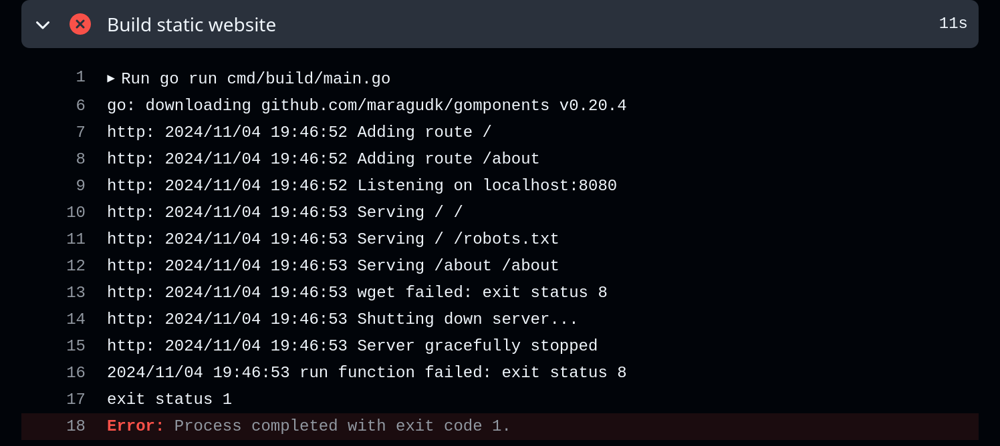

## Development

`go run cmd/develop/main.go` should start server on `localhost:8080`

posts ideas
- this static website builder
- benchy
- kobo holder
- keyboards

### setup 

create empty gh-pages branch

push to origin

configure pages in github repo settings

#### Errors

##### `run function failed: exit status 8`

The error occurs because `static/styles.css` is not present when `wget` is downloading the site. This is most likely because `tailwind` was not run or failed to generate the file.

##### `permissions to [repo] denied to github-actions[bot].`

![permissions to [repo] denied to github-actions[bot].](static/push-gh-pages-permission-denied-error.png)

The error occurs because the deploy workflow does not have permission to write to the repository (to commit to the `gh-pages` branch). This can be fixed by adding the [`contents: write`](https://github.com/jmoggr/jmoggr.com/commit/878bb75c3a39cad96c2959c392d9a8702b88d782) permission to the deploy workflow.